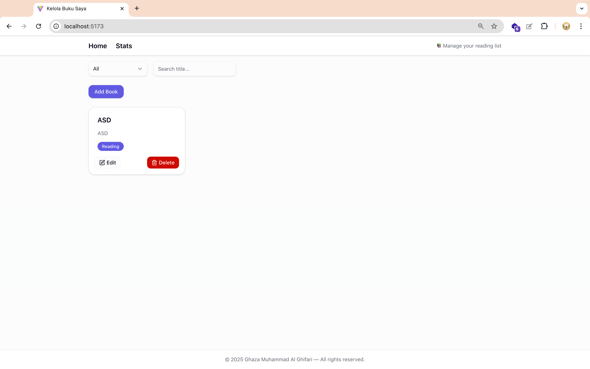
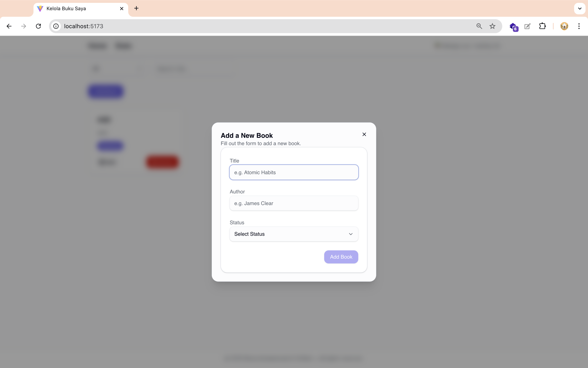
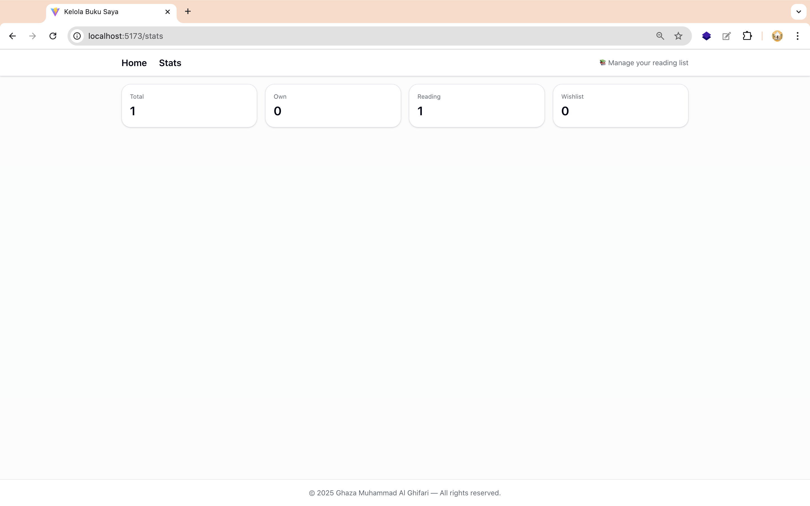

# 📚 React Book Management App

Aplikasi pengelolaan koleksi buku berbasis **React.js**, dirancang agar pengguna dapat dengan mudah menambah, mengedit, menghapus, memfilter, dan mencari buku. Memanfaatkan **React Context** untuk manajemen global state dan **localStorage** untuk persistensi data.

---

## 🚀 Fitur Utama

- ✅ Tambah buku baru (judul, penulis, status)
- ✏️ Edit detail buku yang sudah ada
- 🗑️ Hapus buku dari koleksi
- 🔍 Cari buku berdasarkan judul
- 🧩 Filter berdasarkan status: `Own`, `Reading`, `Wishlist`
- 📊 Statistik buku terkelola secara otomatis

---

## 🖼️ Tampilan Aplikasi

| Home | Tambah Buku | Edit Buku | Statistik |
|------|-------------|-----------|-----------|
|  |  |  |  |

> UI modern, responsive, dan mendukung dark mode (jika diimplementasi lebih lanjut).

---

## 🧪 Coba Aplikasi

🔗 [https://pemrograman-web-itera-121140215.vercel.app/](#)

---

## 🛠️ Teknologi yang Digunakan

- React 18
- React Router
- Radix UI (Dialog, Tooltip, Select)
- Tailwind CSS (dengan class-variance-authority)
- Lucide Icons
- LocalStorage API

---

## 📁 Struktur Proyek (Ringkasan)

/src
├── components/
├── context/
├── hooks/
├── pages/
└── App.jsx
